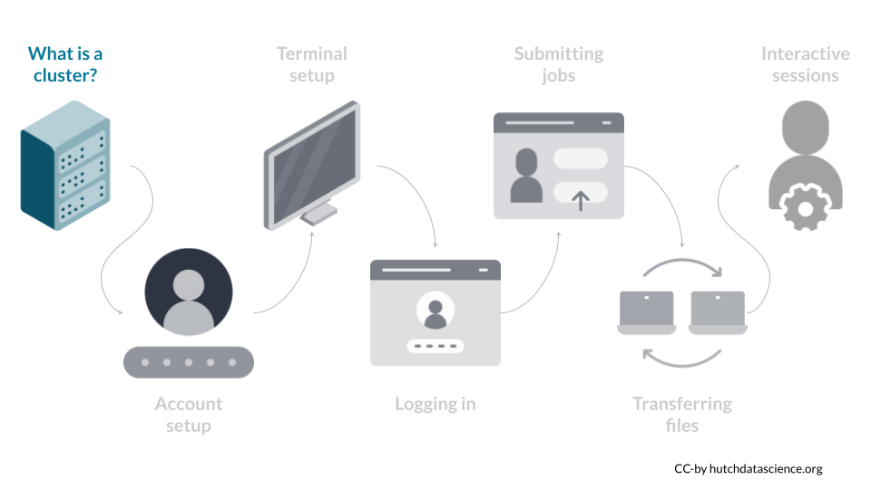
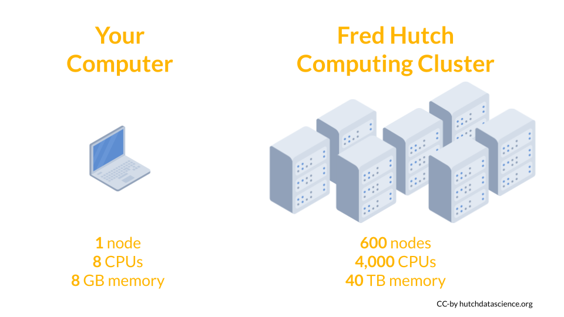
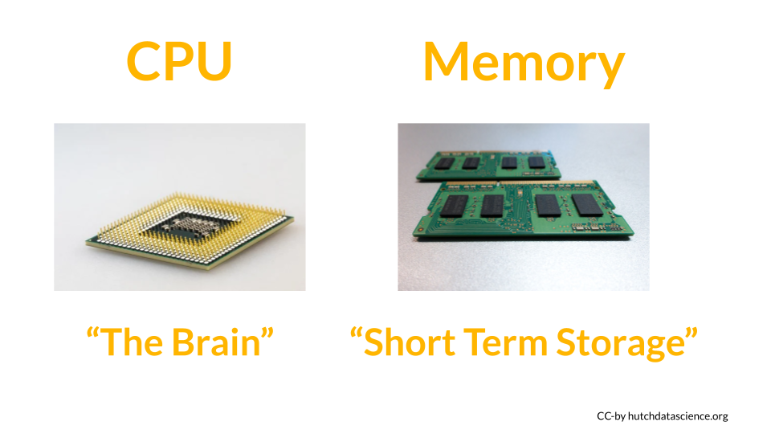

# (PART\*) Introduction {-}

# What is a Cluster {#what-is-a-cluster}

A computing cluster is a set of many computers networked together. Because there are many computers working together, the network is able to handle computationally expensive tasks, like genome assemblies or advanced algorithms. Imagine you're building a house. It would take a long time by yourself! It's much better to have many builders working together.

Now that we have a team of workers, the next challenge is task management. A home construction team will need a manager to help delegate tasks. Similarly, the computing cluster uses management software to prioritize tasks, delegate workers (resources), and check on progress. The Fred Hutch cluster uses a common management and scheduling tool called [Slurm](https://slurm.schedmd.com/overview.html){target="_blank"}.

How is the cluster different from a laptop or desktop? First, on your laptop you most likely interact with it using an operating system like Windows or MacOS. The Fred Hutch cluster uses a Linux operating system. Second, because many people use the cluster for many tasks, there isn't a central screen and keyboard. You access the cluster remotely from your computer! We will talk more about how to connect to the cluster in a [following chapter](#terminal). Third, because the cluster is a set of many computers networked together, you will usually access only a few of the many computers for your work. 

## Parts of the Cluster

Each of the networked computers within a cluster is called a **Node**. Each node has two main components:

The **CPU**, or Central Processing Unit, is the brain of the computer that performs and orchestrates computational tasks. Modern computers often have multiple CPUs (or also known as "cores") to perform multiple tasks at once, ranging from 4 tasks on a typical laptop to 48 tasks or more on higher end servers. Examples of tasks can be running a simulation many times, in which each CPU performs a simulation in parallel. 

The **RAM**, or Random Access Memory, is often simply referred to as memory. This short term memory holds the information that the CPU needs to perform calculations. One distinctive feature of memory is that it is short term. In other words, when the electricity is shut off, the data stored in memory disappears. To save the CPU's work, you usually save files to your computer. Running highly complicated analyses or algorithms can often require additional memory resources.

On your own personal computer, you may have 2-4 CPUs, and 8-16 Gigabytes of working memory. On the Fred Hutch cluster, there are around 600 nodes, and each node has a huge amount of CPUs and RAM compared to your personal computer: for instance, each "K Node" have 36 CPUs and 700GB of RAM, and each "J Node" have 24 CPUs and 350 of RAM! Therefore, when you access any of these K or J nodes, you will be sharing its computing power with other users also.

**Computing cluster**  
  
A set of computers networked together to perform large tasks.

**Node** 

One of the networked computers in the cluster. 

**CPU** 

A computer component that performs and orchestrates computational tasks.

**Memory** 

A computer component that stores calculations and information in the short term.

